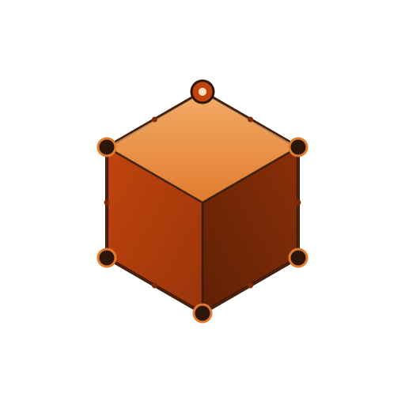

<p align="center">
  <picture>
    <source media="(prefers-color-scheme: dark)" srcset="assets/logo-dark.svg">
    
  </picture>
</p>

<h1 align="center">Oxide-KV</h1>

<p align="center">
  A distributed key-value store in Rust implementing the <b>Raft Consensus<br>
  Algorithm</b>, with a Log-Structured Merge-Tree storage engine, Protobuf<br>
  inter-node RPC, and a Two-Phase Commit lifecycle for atomic multi-key<br>
  writes.
</p>

<p align="center"><i>Lightweight by design — every line is meant to be read.</i></p>

<p align="center">
  <a href="https://github.com/yuw1/oxide-kv/actions"></a>
  <a href="./LICENSE"></a>
  <a href="https://www.rust-lang.org"></a>
  <a href="#development"></a>
</p>

---

## Features

### Consensus (Raft core, all of §5 + §6.4)

- **Leader election** with randomized timeouts (3-5s) and term-based
  step-down.
- **Election restriction** (§5.4.1) — votes only for candidates with a
  log at least as up-to-date as the voter's.
- **AppendEntries** RPC with heartbeats; **commit safety** (§5.4.2) — a
  leader never commits entries from previous terms by replica count
  alone.
- **Snapshot + InstallSnapshot RPC** (§7) — bounded WAL growth and
  catch-up for lagging followers.

### Correctness hardening

- **Linearizable reads via ReadIndex** (§6.4) — `Get` no longer risks
  stale data from a partitioned leader. The leader proves it still
  holds quorum before serving the value.
- **Crash recovery** — on restart the WAL replays into the in-memory
  table; SSTables are discovered from disk and the sparse key range
  is used to skip irrelevant ones on read.

### Storage

- **Log-Structured Merge Tree** state machine: in-memory memtable
  (BTreeMap) backed by an append-only WAL, with sorted on-disk
  SSTables and size-tiered compaction.
- **Atomic single-key writes** via the Raft log; **atomic multi-key
  writes** via the 2PC lifecycle below.

### Coordination

- **Two-Phase Commit lifecycle** — `BeginTx` stages ops, `Vote`
  records participant votes, `DecideTx` commits or aborts atomically.
  Pending ops are isolated from reads until commit. Single-node
  coordinator uses a fast path that appends BeginTx + DecideTx as one
  Raft proposal.

### Plumbing

- **Protocol Buffers** over length-prefixed TCP for inter-node Raft
  RPC. Replaces the original JSON encoding; ~30% smaller payloads,
  faster encode/decode. Wire schema lives in `proto/raft.proto`.
- **Async Tokio** runtime for RPC handling and concurrent client
  connections.
- **Apache-2.0** license. Zero compiler warnings. 105 unit tests.

---

## Architecture

```
            ┌────────────────────────────────────────────────┐
            │                  RaftNode                       │
            │                                                │
   Client → │   ┌──────┐  log entries  ┌──────────────┐      │
   (JSON)   │   │ Get  │──────────────▶│ RaftStorage  │      │
            │   │ Set  │  AppendEntries │  - meta.json │      │
            │   │BeginTx│              │  - NNN.sst   │      │
            │   │ Vote │              │  - NNN.meta  │      │
            │   │Decide│              │  - WAL       │      │
            │   └──────┘              └──────────────┘      │
            │       │                       │                │
            │       ▼                       ▼                │
            │   ┌──────────┐         ┌─────────────┐          │
            │   │ LSM tree │         │  Raft log   │          │
            │   │ StateMch │         │  (bincode)  │          │
            │   └──────────┘         └─────────────┘          │
            │       │                                        │
            │       ▼                                        │
            │   pending_txs: BTreeMap<TxId, PendingTx>        │
            │   (isolated from reads until DecideTx)         │
            └────────────────────────────────────────────────┘
                              │ TCP + length-prefixed protobuf
                              ▼
                    peer RaftNodes (same code)
```

### Node lifecycle

- **Follower** — passive, responds to RPCs.
- **Candidate** — active during election.
- **Leader** — handles client requests and replicates the log.

### Inter-node RPC

| RPC | Purpose |
|---|---|
| `RequestVote` | Election |
| `AppendEntries` | Log replication + heartbeat |
| `InstallSnapshot` | Send a snapshot to a lagging follower |

Wire schema: [`proto/raft.proto`](./proto/raft.proto). 4-byte big-endian
length prefix + protobuf payload.

### Storage engine

- **Raft log** (`wal`): bincode-serialized log entries, replayed on
  restart.
- **State machine WAL** (`memtable.wal`): JSON-line op log, fsync per
  write, replayed on restart.
- **Memtable** (`BTreeMap<String, MemEntry>`): in-memory sorted
  buffer, flushed when it crosses the size threshold.
- **SSTables** (`sst/NNNNNN.sst` + `.meta`): sorted JSON entries on
  disk; sparse key range used to skip irrelevant tables.
- **Compaction** (size-tiered): merges all SSTables into one, drops
  tombstones with no possible resurrection.

### Two-phase commit

- **BeginTx** (log entry): stages ops in `pending_txs`, NOT in
  memtable. Reads cannot see them.
- **Vote** (log entry): records a participant's Yes/No vote.
- **DecideTx** (log entry): `Commit` applies all pending ops
  atomically; `Abort` discards them.

---

## Quick Start

### Prerequisites

Rust 2024 edition (stable). For Protobuf code generation the build
expects `protoc` to be on `PATH`; CI installs it automatically.

### Run a 3-node cluster

Three terminals:

```bash
# Node 1
cargo run -- \
  --addr 127.0.0.1:8001 --client-addr 127.0.0.1:9001 \
  --peers 127.0.0.1:8002 127.0.0.1:8003

# Node 2
cargo run -- \
  --addr 127.0.0.1:8002 --client-addr 127.0.0.1:9002 \
  --peers 127.0.0.1:8001 127.0.0.1:8003

# Node 3
cargo run -- \
  --addr 127.0.0.1:8003 --client-addr 127.0.0.1:9003 \
  --peers 127.0.0.1:8001 127.0.0.1:8002
```

### Single-key ops (JSON over TCP to leader's client port)

```bash
echo '{"Set":{"key":"hello","value":"world"}}' | nc 127.0.0.1 9001
echo '{"Get":{"key":"hello"}}' | nc 127.0.0.1 9001
echo '{"Delete":{"key":"hello"}}' | nc 127.0.0.1 9001
```

`Get` uses the ReadIndex path, so a partitioned leader will refuse to
serve stale data instead of returning it.

### Multi-key atomic op (2PC fast path)

```bash
echo '{"BeginTx":{"tx_id":"t1","ops":[
  {"Put":{"key":"a","value":"1"}},
  {"Put":{"key":"b","value":"2"}}
]}}' | nc 127.0.0.1 9001
```

In a single-node cluster the leader auto-pairs this with
`DecideTx(Commit)` so the transaction applies atomically. For a
multi-node cluster the commands are in the wire schema; the
coordinator-side vote collection RPC is on the roadmap.

### Manual 2PC control (for testing the lifecycle)

```bash
# Stage a tx
echo '{"BeginTx":{"tx_id":"t2","ops":[{"Put":{"key":"k","value":"v"}}]}}' | nc 127.0.0.1 9001
# Vote on it
echo '{"Vote":{"tx_id":"t2","voter":"node-1","vote":{"Yes":null}}}' | nc 127.0.0.1 9001
# Commit (or Abort instead)
echo '{"DecideTx":{"tx_id":"t2","decision":"Commit"}}' | nc 127.0.0.1 9001
```

---

## Safety & Consistency

The following properties are verified by the test suite.

- **§5.4.1 vote safety** — `(last_log_term > my_term) || (last_log_term == my_term && last_log_index >= my_index)`.
- **§5.4.2 commit safety** — a leader only directly commits entries
  from its own current term; previous-term entries are committed
  implicitly when a current-term entry from the same index replicates.
- **Linearizable reads** — `confirm_read` enforces three guards:
  still leader, `last_applied >= ri.index`, and a fresh quorum proof
  (`last_quorum_heartbeat_at`) at or after the read's `issued_at`.
- **Snapshot install safety** — `handle_install_snapshot` rejects
  stale terms, truncates the log to `> last_included_index`, resets
  `commit_index` / `last_applied`, and persists before replying.
- **LSM durability** — WAL is fsync'd per write; SSTables are written
  via atomic rename. `restore_wal_log` is the single recovery path.
- **2PC read isolation** — pending ops in `pending_txs` are not in
  the memtable; `get` never returns a value that hasn't been
  committed via `DecideTx(Commit)`.

---

## Development

```bash
cargo build --all-targets     # 0 warnings
cargo test                    # 105 passed
```

Test layout: 8 modules, in-source `#[cfg(test)] mod tests` plus a few
integration tests in `raft::proto` and `raft::rpc`. Each test runs
against an isolated tempdir; the production binary is not required.

### Project layout

```
src/
├── client.rs          Client JSON protocol handler
├── config.rs          Global config (OnceLock)
├── lib.rs
├── main.rs            CLI entry point
├── protocol.rs        Command / LogEntry / Snapshot / 2PC types
├── state_machine.rs   LSM tree (memtable + WAL + SSTable)
├── raft/
│   ├── node.rs        RaftNode (election, log, snapshot, 2PC, read-index)
│   ├── proto.rs       Protobuf <-> domain conversions
│   ├── rpc.rs         TCP+protobuf client/server
│   ├── storage.rs     WAL + meta + snapshot on disk
│   └── timer.rs       Election timer
proto/
└── raft.proto         Wire schema
```

---

## Running the simulation (P7 DST)

The fuzz harness in `tests/raft_fuzz.rs` runs the real RaftNode code
under deterministic fault injection (kill / restart / partition /
heal / election / yield) and cross-checks post-run state against the
safety invariant checker and a sequential reference model.

### Default CI

PR / push runs the 5 default sweeps (~601 scenarios, ~8 min):

```text
fuzz_default_seeds_0_to_200       200 scenarios × 25 actions
fuzz_default_seeds_1000_to_1200   200 scenarios × 25 actions
fuzz_long_seeds_2000_to_2100      100 scenarios × 50 actions
fuzz_short_seeds_3000_to_3100     100 scenarios × 5 actions
fuzz_smoke_single_seed            1 trivial scenario
```

### Nightly sweep

A separate `#[ignore]` entry runs a fresh 1000-scenario sweep,
driven by `.github/workflows/nightly.yml` on a daily cron
(02:00 UTC). Locally:

```bash
cargo test --release --test raft_fuzz -- \
  --ignored fuzz_nightly_seeds_10000_to_11000 --nocapture
```

### Reproducing a failing seed

When a fuzz test panics, the message includes the failing seed and
the full action sequence. To turn that into a minimal repro:

```bash
OXIDE_FUZZ_SEED=<seed> OXIDE_FUZZ_LEN=<len> \
  cargo test --release --test raft_fuzz shrink_repro -- \
  --ignored --nocapture
```

The shrinker (`PR #30`) applies delta debugging — chunk removal
followed by single-element removal — and emits a copy-pasteable
`Vec<Action>` literal you can drop into a regression test.

### Action vocabulary

The fuzzer draws actions from this set. Each action is parameterized
with a random sample from the seeded RNG so the same seed always
produces the same sequence.

| Action | What it does |
|---|---|
| `SubmitSet { key, value }` | propose a `Set` op on the current leader |
| `SubmitDelete { key }` | propose a `Delete` op on the current leader |
| `SubmitTx { tx_id, ops }` | drive a real 2PC round (`BeginTx` → vote fan-out → `DecideTx`) on the leader via the production coordinator |
| `DriveElection { candidate_idx }` | force node `candidate_idx` to start a new election |
| `KillNode { idx }` | crash node `idx` (its heartbeat / serve loops stop, on-disk WAL/meta preserved) |
| `RestartNode { idx }` | bring a killed node back; reloads WAL, restarts loops |
| `PartitionLink { from, to }` | drop messages on the directed link `from -> to` |
| `HealPartitions` | restore every dropped link |
| `Yield` | let the runtime advance a few ticks (so heartbeats / replication can propagate) |

Default distribution: 30% plain ops, 12% 2PC tx, 18% kill/restart,
18% partition/heal, 12% election, 10% yield. After every op
action the harness gives the cluster a beat to replicate before
cross-checking. The 2PC round is bounded to 1s; a timeout cancels
the round (worst case a `BeginTx` is committed with no
`DecideTx`, which both the 2PC-atomicity invariant and the
reference model tolerate).

### From panic to regression test

When a fuzz scenario fails, the panic message contains:

1. **The failure mode** — `invariant violation: ...`, `reference model mismatch on leader nN ...`, or `follower nN log diverges from leader ...`.
2. **The seed and action length** — pick these out of the panic header and run the shrinker.
3. **The full action sequence** — preserved verbatim for diff against the shrunk sequence.

To convert a failing seed into a locked-in regression test:

```bash
# Step 1: shrink. Prints a minimal Vec<Action> literal.
OXIDE_FUZZ_SEED=<seed> OXIDE_FUZZ_LEN=<len> \
  cargo test --release --test raft_fuzz shrink_repro -- \
  --ignored --nocapture
```

The shrinker output ends with a block like:

```rust
let actions = vec![
    Action::SubmitSet { key: "k2".into(), value: "v1".into() },
    Action::PartitionLink { from: 0, to: 1 },
    Action::RestartNode { idx: 1 },
];
run_actions(&actions).await.unwrap();
```

Paste it into a new `#[tokio::test]` in `tests/raft_fuzz.rs` (or a
new `tests/regressions_p7.rs` if you prefer to keep fuzz tests
separate). The minimal sequence still reproduces the failure
under `cargo test`, so a follow-up fix PR can verify the
regression is gone with a single `cargo test --test raft_fuzz`.

If a real bug is surfaced, file the fix in its own
`fix/...` branch — the P7 fuzz harness *tests* the existing
code; fixes don't belong inside the harness PRs.

---

## Roadmap

The active roadmap lives in [ROADMAP.md](./ROADMAP.md). That file is
the single source of truth for phase status, in-progress work, and
acceptance criteria. The current phase is **P7 ✅ — Deterministic
simulation testing (DST)** (shipped via PRs #25–#31; the next
phase is to be proposed).

### Phase summary

| Phase | Capability | Status | PR |
|---|---|---|---|
| P0 | LICENSE, CHANGELOG, unit tests, warning cleanup | ✅ | [#1](https://github.com/yuw1/oxide-kv/pull/1) |
| P1 | Snapshot + InstallSnapshot RPC + log compaction | ✅ | [#2](https://github.com/yuw1/oxide-kv/pull/2) |
| P2 | Linearizable reads via ReadIndex | ✅ | [#3](https://github.com/yuw1/oxide-kv/pull/3) |
| P3 | Protobuf binary RPC | ✅ | [#4](https://github.com/yuw1/oxide-kv/pull/4) |
| P4 | LSM-Tree state machine | ✅ | [#5](https://github.com/yuw1/oxide-kv/pull/5) |
| P5 | 2PC lifecycle (BeginTx / Vote / DecideTx) | ✅ | [#6](https://github.com/yuw1/oxide-kv/pull/6) |
| Bug | Election timer brain-split + heartbeat:election ratio | ✅ | [#8](https://github.com/yuw1/oxide-kv/pull/8) |
| Bug | Single-node read fallback + commit advancement | ✅ | [#9](https://github.com/yuw1/oxide-kv/pull/9) |
| P6 | Multi-node 2PC coordinator RPC | ✅ | [#11](https://github.com/yuw1/oxide-kv/pull/11)–[#14](https://github.com/yuw1/oxide-kv/pull/14) |
| **P7** | **Deterministic simulation testing (DST)** | **✅** | [#25](https://github.com/yuw1/oxide-kv/pull/25)–[#31](https://github.com/yuw1/oxide-kv/pull/31) |

### Candidate future directions (see ROADMAP.md for full list)

- Deterministic simulation testing (P7, active) — fault injection + invariant proofs
- Sharded multi-Raft
- Joint consensus for membership change (Raft §6)
- Tx timeout + admin-driven abort
- Client SDKs (Python, Go)
- Benchmark suite
- LSM polish (bloom filters, block cache, background compaction, leveled)
- gRPC transport
- TLS for inter-node RPC and client API
- Per-read ack tracking for full ReadIndex
- Metrics export (Prometheus)

---

## License

Apache-2.0. See [LICENSE](./LICENSE).